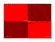

# Open The Gate

## Legendary Mission

### Mission Briefing
_The combined psychic might of the seers Urgon Seeranthil and Kinsha Ulthos have at last tracked down the hidden remnants of the major Webway node of PU-55 sector. Now they must repair the portal to allow their allies access. But their enemies are closing in..._

### Mission Rules
*Multiplayer Mission:* This mission is for 4 players (1 Defender and 3 Attackers). See _Multiplayer Appendix_ below.

*Muster Armies:* The _Danse Macabre_ is the Defender, and have committed their entire Crusade Roster to achieve this objective (currently 2095 points). The Attackers may field up to 1000 points each (assuming 3 Attackers).

*Select Agendas:* The Attackers each select 2 agendas as normal, but may not choose _both of_ 'Assassins' and 'Witch Hunter' because srsly dude. The Defender uses special agendas, see Appendix.

*Create the Battlefield:* The Webway Gate is in the centre of the battlefield, on top of the Wraithbone Platform. Other terrain pieces may not be placed within 3" of the Wraithbone Platform.

*Choose Deployment Zones:* The Defender's deployment zone is the Wraithbone Platform. The Attackers should roll off, with the highest choosing their deployment zone first etc.

*Declare Reserves and Transports:* The Defender may not use the _Strategic Reserves_ rule.

*Webway Gate:* The Webway Gate begins the game with 7 wounds remaining. Its 'Webway Strike' rule may not be used.

*Wraithbone Platform:* The Wraithbone Platform is Area Terrain. Subtract 1 from the hit roll when resolving an attack with a ranged weapon that targets an *INFANTRY* unit that is wholly on or within the terrain feature. _Handwave swirling psychic energies or similar BS._

*Reknit Wraithbone (Psychic Action - Warp Charge 5):* One *PSYKER CHARACTER* from your army can attempt to perform this psychic action in your Psychic Phase if it is within 6" of the Webway Gate. If successful, the Webway Gate regains D3 wounds.

*Bonesinger:* The Bonesinger can use 'Path of the Shaper' on the Webway Gate even though it doesn't have the *<CRAFTWORLD>* keyword.

### Mission Objectives

#### Progressive
At the end of the Battle Round, each player scores victory points for each of the following conditions they satisfy:

* They destroyed at least one enemy unit in this Battle Round. 5 points.
* *Attacker:* They destroyed more enemy units than any other Attacker. 10 points.
* *Attacker:* They caused at least one wound to the Webway Gate. 5 points.
* *Defender:* They restored at least one wound to the Webway Gate. 5 points.

#### End of Game
If the Webway Gate is not destroyed at the end of the battle, the Defender scores 50 victory points.

If the Webway Gate is destroyed, the Attacker who destroyed it scores 30 victory points.

### Victor Bonus
*Defender Victory:* The Danse Macabre may now use Stratagems and rules with 'Webway' in the name. They may also recruit *GUARDIAN* units.

*Attacker Victory:* One unit that took part in the battle gains a Battle Trait of your choice. (This must be a unit that can gain Battle Honours).

[appendix]
## Defender Agendas

### Open the Gate
Each unit that restored at least 1 wound to the Webway Gate gains 1 experience point.

### At All Costs
Each unit that destroyed an enemy unit gains 1 experience point.

[appendix]
## Multiplayer Battles

### Turn Order
At the beginning of each Battle Round, players roll off on 2d6. The highest score goes first, second highest second, etc.

### Charge Phase
Heroic Intervention may only be used for a unit within 3" of a unit belonging to the player whose turn it is, and only to engage that player's units.

### Fight Phase
Only units of the player whose turn it is, and units engaged with those units, are eligible to fight.